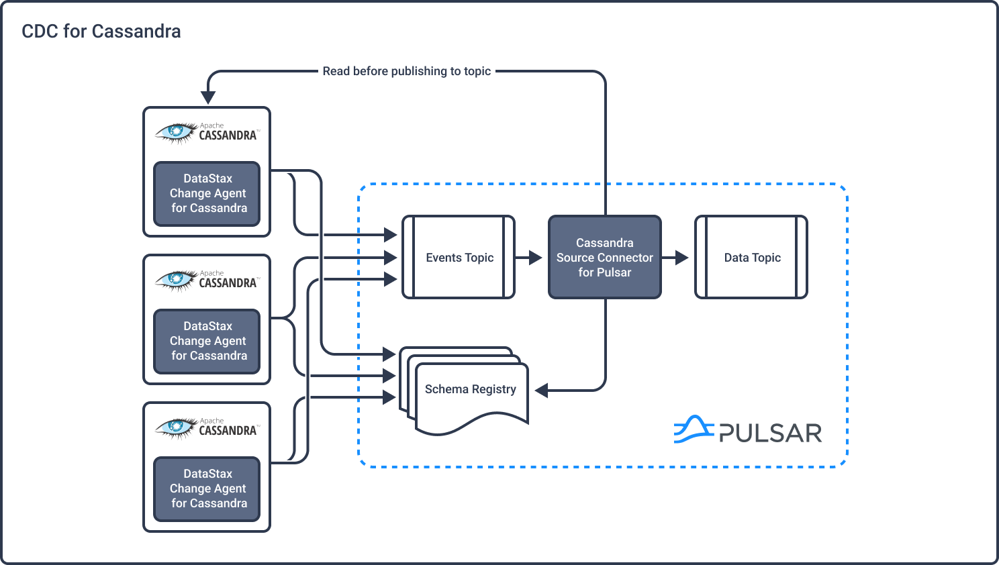

# Cassandra CDC Replication.

The Cassandra CDC replication requires:
* A message producer deployed as a JVM agent on each Cassandra node.
* A Cassandra Source Connector deployed in the streaming platform.

Supported streaming platform:
* Apache Pulsar

Supported Cassandra version:
* Cassandra 3.11
* Cassandra 4.0
* Datastax Enterprise Server 6.8.16+

## Documentation

All documentation is available online [here](https://datastax.github.io/cassandra-source-connector/).

See the [QUICKSTART.md](QUICKSTART.md) page.

## Limitations

* Does not replay logged batches
* Does not manage table truncates
* Does not manage TTLs
* Does not support range deletes
* Does not sync data available before starting the CDC producer.
* CQL column names must not match a Pulsar primitive type name (ex: INT32)

## Supported data types

Cassandra supported CQL3 data types (with the associated AVRO type or logical-type):

* text (string), ascii (string)
* tinyint (int), smallint (int), int (int), bigint (long), double (double), float (float),
* inet (string)
* decimal (cql_decimal), varint (cql_varint), duration (cql_duration)
* blob(bytes)
* boolean (boolean)
* timestamp (timestamp-millis), time (time-micros), date (date)
* uuid, timeuuid (uuid)
* User Defined Types (record)

## Build from the sources

    ./gradlew assemble

## Acknowledgments

Apache Cassandra, Apache Pulsar, Cassandra and Pulsar are trademarks of the Apache Software Foundation.
