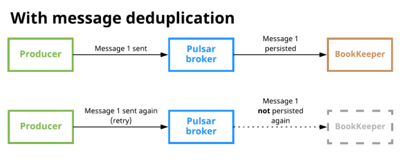

# CDC Replication to Elasticsearch using Pulsar.

## Architecture

Here is the replication pipeline from Cassandra to Elasticsearch using Pulsar.

Replication steps:
1. Cassandra write mutation in a commitlog file (sync every 10s)
2. The pulsar-producer detected the created/modified files
3. The pulsar-producer publish one message per C* mutation key=[ks, table, pk] payload=[nodeId, writetime]
4. The pulsar consumer check the last writetime from its memory cache, and fetch the writetime from elasticsearch if not available from the cache
5. The pulsar consumer read the C* row from the source Cassandra node
6. The pulsar consumer insert/update the elasticsearch document (including the writetime) 

A Pulsar key-shared subscription ensure all mutations for a given primary key are processeed sequentially.

Additionally, even if Pulsar deduplication is enabled, it does not deduplicate messages processed buy the pulsar consumers.
It only deduplicate message storage in bookkeeper as show in the following figure.

So the pulsar consumer keep the last sync writetime in a memory cache to deduplicate the same Cassandra mutation 
coming from multiple replicas.

## Build docker image

    ./gradlew dockerBuild
    
Creating native image inside Docker:

    ./gradlew dockerBuildNative

Docker push

    docker push vrtestregistry.azurecr.io/datastax/cassandra-cdc-producer:0.1-SNAPSHOT
    docker push vrtestregistry.azurecr.io/datastax/cassandra-cdc-consumer:0.1-SNAPSHOT
    
JIB Build

    ./gradlew clean producer:jib -Djib.to.auth.username=$DOCKER_USERNAME -Djib.to.auth.password=$DOCKER_PASSWORD
    ./gradlew clean consumer:jib -Djib.to.auth.username=$DOCKER_USERNAME -Djib.to.auth.password=$DOCKER_PASSWORD

## Configuration

See the **resources/application.yml** files.

## Run

## Monitoring

The consumer and producer JVM expose the [default micronaut endpoints](https://docs.micronaut.io/latest/guide/index.html#management), including metrics.
