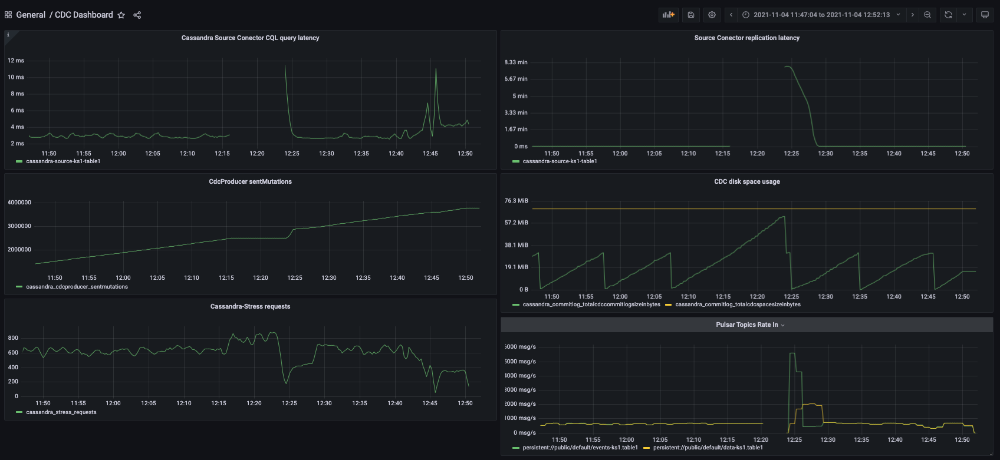

# DataStax CDC for Apache Cassandra

[](https://github.com/datastax/cdc-apache-cassandra/actions/workflows/ci.yaml)


[](https://github.com/datastax/cdc-apache-cassandra/releases/latest)

DataStax CDC for Apache Cassandra streams row-level mutations from Cassandra commit logs to a messaging platform in near real-time. The pipeline has two independently deployable components:

* **CDC Agent** — a JVM agent attached to each Cassandra node that reads commit log files and publishes mutation events to an *events topic*.
* **Source Connector** — a connector running in your messaging platform that consumes the events topic, queries Cassandra for the full row, and publishes it to a *data topic*.

```
Cassandra node
  └─ commit log
       └─ CDC Agent  ──►  events topic  ──►  Source Connector  ──►  data topic
```

## Supported messaging platforms

| Platform | Version |
|----------|---------|
| Apache Pulsar | 2.8.1+ |
| Apache Kafka | 2.8+ (Kafka Connect) |

## Supported Cassandra versions

| Distribution | Version |
|--------------|---------|
| Apache Cassandra | 3.11+ |
| Apache Cassandra | 4.0+ |
| DataStax Enterprise (DSE) | 6.8.16+ |

> **Note:** Only Cassandra 4.0 and DSE 6.8.16+ support near real-time CDC, replicating data as soon as mutations are synced to disk.

---

## Documentation

* **Quick start (Pulsar):** [QUICKSTART.md](QUICKSTART.md)
* **Full documentation:** [CDC for Apache Cassandra docs](https://docs.datastax.com/en/cdc-for-cassandra/docs/latest/index.html)

---

## Architecture

### Data flow

```
Cassandra node
  └─ CDC commit log files
       └─ Agent (JVM agent)
            └─ CommitLogReaderService  ──reads──►  AbstractMutation
                 └─ MutationSender  ──publishes──►  Pulsar / Kafka  (events topic)
                                                           │
                                              Connector (Pulsar Source or Kafka Connect)
                                                           │
                                              Reads event → queries Cassandra via CQL
                                                           │
                                              Publishes full row ──►  data topic
```

---

## CDC Agent configuration

The agent is attached to Cassandra via the `-javaagent` JVM flag. Configuration can be supplied as inline key=value pairs, via a properties file, or via environment variables (lowest to highest precedence):

1. Defaults / environment variables
2. Properties file (named by `configFile` or `kafkaConfigFile` agent arg)
3. Inline agent args string

### Platform selection

Set the `platform` agent parameter or the `CDC_PLATFORM` environment variable:

```
-javaagent:/path/to/agent.jar=platform=KAFKA,kafkaConfigFile=/etc/cdc/kafka.properties
-javaagent:/path/to/agent.jar=platform=PULSAR,pulsarServiceUrl=pulsar://broker:6650
```

Default is `PULSAR` when omitted.

### Platform-prefix scoping

Each platform uses its own config file. Keys are written **without** the platform prefix — the agent prepends it internally when matching against registered settings (e.g. file key `bootstrapServers` → setting `kafkaBootstrapServers`). Unrecognised keys pass through as-is, so any standard producer property (e.g. `compression.type`, `acks`) reaches the underlying client unchanged.

**`kafka.properties`** (pointed to by `kafkaConfigFile`):
```properties
bootstrapServers=broker:9092
batchDelayInMs=5
```

**`pulsar.properties`** (pointed to by `pulsarConfigFile`):
```properties
serviceUrl=pulsar://broker:6650
```

### Common settings (all platforms)

| Setting | Default | Env var | Description |
|---------|---------|---------|-------------|
| `topicPrefix` | `events-` | `CDC_TOPIC_PREFIX` | Topic name prefix. `<keyspace>.<table>` is appended. |
| `cdcWorkingDir` | `<storagedir>/cdc` | `CDC_WORKING_DIR` | Working directory for offset tracking and archived commit logs. |
| `cdcPollIntervalMs` | `60000` | `CDC_DIR_POLL_INTERVAL_MS` | Polling interval (ms) for new commit log files. |
| `cdcConcurrentProcessors` | `-1` (auto) | `CDC_CONCURRENT_PROCESSORS` | Number of concurrent commit log processors. |
| `errorCommitLogReprocessEnabled` | `false` | `CDC_ERROR_COMMITLOG_REPROCESS_ENABLED` | Re-process commit logs that previously failed. |

### Pulsar-specific agent settings

| Setting | Default | Env var | Description |
|---------|---------|---------|-------------|
| `pulsarConfigFile` | — | — | Path to a Pulsar client config file. |
| `pulsarServiceUrl` | `pulsar://localhost:6650` | `CDC_PULSAR_SERVICE_URL` | Pulsar broker URL. |
| `pulsarBatchDelayInMs` | `-1` (disabled) | `CDC_PULSAR_BATCH_DELAY_IN_MS` | Batching linger time in ms; ≤0 disables batching. |
| `pulsarKeyBasedBatcher` | `false` | `CDC_PULSAR_KEY_BASED_BATCHER` | Use `KEY_BASED` batch builder. |
| `pulsarMaxPendingMessages` | `1000` | `CDC_PULSAR_MAX_PENDING_MESSAGES` | Max in-flight messages before back-pressure. |
| `pulsarMemoryLimitBytes` | `0` (disabled) | `CDC_PULSAR_MEMORY_LIMIT_BYTES` | Client memory limit in bytes. |
| `pulsarAuthPluginClassName` | — | `CDC_PULSAR_AUTH_PLUGIN_CLASS_NAME` | Pulsar authentication plugin class. |
| `pulsarAuthParams` | — | `CDC_PULSAR_AUTH_PARAMS` | Pulsar authentication parameters. |

### Kafka-specific agent settings

The Kafka producer is configured via a standard Kafka producer properties file pointed to by `kafkaConfigFile`. All standard Kafka producer properties are accepted.

| Setting | Default | Env var | Description |
|---------|---------|---------|-------------|
| `kafkaConfigFile` | — | `CDC_KAFKA_CONFIG_FILE` | Path to a Kafka producer `.properties` file. All keys are passed through to the producer. |

**Minimum `kafka.properties` for a plaintext broker:**

```properties
bootstrapServers=broker1:9092,broker2:9092
```

**With SSL:**

```properties
bootstrapServers=broker:9093
securityProtocol=SSL
ssl.keystore.location=/etc/kafka/ssl/keystore.jks
ssl.keystore.password=changeit
ssl.truststore.location=/etc/kafka/ssl/truststore.jks
ssl.truststore.password=changeit
```

**With SASL/PLAIN:**

```properties
bootstrapServers=broker:9092
securityProtocol=SASL_PLAINTEXT
sasl.mechanism=PLAIN
sasl.jaas.config=org.apache.kafka.common.security.plain.PlainLoginModule required \
  username="alice" password="secret";
```

Additional agent-level Kafka settings (set in the same properties file or inline):

| Setting key | Default | Description |
|-------------|---------|-------------|
| `bootstrapServers` | `localhost:9092` | Kafka broker list. |
| `batchDelayInMs` | `-1` (disabled) | Producer `linger.ms`; ≤0 disables. |
| `maxPendingMessages` | `1000` | Max in-flight sends before back-pressure. |
| `securityProtocol` | `PLAINTEXT` | `PLAINTEXT`, `SSL`, `SASL_PLAINTEXT`, `SASL_SSL`. |
| `sslKeystoreLocation` | — | Path to the SSL keystore. |
| `sslKeystorePassword` | — | SSL keystore password. |
| `sslTruststoreLocation` | — | Path to the SSL truststore. |
| `sslTruststorePassword` | — | SSL truststore password. |
| `saslMechanism` | — | e.g. `PLAIN`, `SCRAM-SHA-256`. |
| `saslJaasConfig` | — | Full JAAS config string. |

Any dotted Kafka producer property (e.g. `compression.type`, `acks`) present in the config file is forwarded directly to the `KafkaProducer`.

---

## Kafka Connect source connector setup

### How it works

The Kafka Connect source connector mirrors the Pulsar source connector:

1. Subscribes to the Kafka events topic (produced by the CDC agent with `platform=KAFKA`).
2. Deserialises the Avro-encoded primary key from each event.
3. Queries the full row from Cassandra via CQL.
4. Publishes a `SourceRecord` to the configured output topic.

### Connector configuration

The connector is deployed as a Kafka Connect plugin. Deploy it by placing the connector JAR on the Connect worker's plugin path, then submit a connector config:

The connector assigns one events-topic partition per task. Set `tasks.max` to the number of partitions in the events topic for maximum parallelism.

```json
{
  "name": "cassandra-source-ks1-table1",
  "config": {
    "connector.class": "com.datastax.oss.kafka.source.KafkaCassandraSourceConnector",
    "tasks.max": "1",
    "events.topic": "events-ks1.table1",
    "internal.consumer.bootstrapServers": "broker:9092",
    "internal.consumer.groupId": "cassandra-source",
    "keyspace": "ks1",
    "table": "table1",
    "contactPoints": "cassandra-host",
    "loadBalancing.localDc": "datacenter1",
    "output.topic": "data-ks1.table1",
    "outputFormat": "key-value-avro"
  }
}
```

#### Connector properties reference

| Property | Required | Default | Description |
|----------|----------|---------|-------------|
| `events.topic` | ✓ | — | Kafka topic to consume CDC events from (produced by the agent). |
| `internal.consumer.bootstrapServers` | | `localhost:9092` | Kafka bootstrap servers for the internal events consumer. |
| `internal.consumer.groupId` | | `cassandra-source` | Client ID prefix for the internal events consumer. |
| `internal.consumer.securityProtocol` | | — | Security protocol for the events consumer. |
| `internal.consumer.sslKeystoreLocation` | | — | SSL keystore path for the events consumer. |
| `internal.consumer.sslKeystorePassword` | | — | SSL keystore password for the events consumer. |
| `internal.consumer.sslTruststoreLocation` | | — | SSL truststore path for the events consumer. |
| `internal.consumer.sslTruststorePassword` | | — | SSL truststore password for the events consumer. |
| `internal.consumer.saslMechanism` | | — | SASL mechanism for the events consumer. |
| `internal.consumer.saslJaasConfig` | | — | SASL JAAS config for the events consumer. |
| `keyspace` | ✓ | — | Cassandra keyspace. |
| `table` | ✓ | — | Cassandra table. |
| `contactPoints` | ✓ | — | Cassandra contact point hostnames (comma-separated). |
| `loadBalancing.localDc` | ✓ | — | Cassandra local datacenter name. |
| `output.topic` | ✓ | — | Target Kafka topic for full row data. |
| `outputFormat` | | `key-value-avro` | Output format: `key-value-avro` (key and value both Avro), `key-value-json` (both JSON), or `json` (value only JSON, key Avro). |
| `columns` | | (all) | Regex to select output columns. |
| `heartbeat.topic` | | `<output.topic>-heartbeat` | Topic for heartbeat records (cache-hit mutations). Defaults to the output topic name suffixed with `-heartbeat`. |
| `batch.size` | | `200` | Max number of events consumed per poll. |
| `batch.maxWaitMs` | | `1000` ms | Max time to wait for a full batch before flushing a partial one. |
| `query.executors` | | `2× CPUs` | Number of concurrent CQL query threads. |
| `query.maxTasksInQueue` | | `20× CPUs` | Max pending CQL tasks per thread. Excess triggers backpressure. |
| `query.rateLimit` | | `0` (disabled) | Max Cassandra CQL queries per second. `0` disables the limiter. |
| `schema.registry.url` | | — | Schema Registry URL (e.g. `http://localhost:8081`). Only applies to the Avro output format. When set, values are published in Confluent wire format and schema compatibility is enforced by the registry. |
| `schema.registry.autoRegisterSchemas` | | `true` | Auto-register new schema versions on table alterations. Set to `false` to require pre-registration. |
| `schema.registry.basicAuth.credentialsSource` | | — | Basic auth credentials source for the registry, e.g. `USER_INFO`. |
| `schema.registry.basicAuth.userInfo` | | — | Credentials as `<username>:<password>`. Used when `credentialsSource=USER_INFO`. |
| `cache.max.digest` | | `3` | Maximum number of digests cached per primary key. |
| `cache.max.capacity` | | `32767` | Maximum number of primary keys in the mutation cache. |
| `cache.expire.after.ms` | | `60000` | Cache TTL in milliseconds. |
| `row.key.converter` | | — | *(Advanced)* Fully-qualified converter class for the output record key. Overrides the default Avro/JSON key serialization. |
| `row.value.converter` | | — | *(Advanced)* Fully-qualified converter class for the output record value. Overrides the default Avro/JSON value serialization. |

### Schema Registry

The Kafka source connector optionally integrates with a schema registry for the Avro output format. It uses the Confluent Schema Registry client, which is compatible with any registry that implements the Confluent Schema Registry API (including Confluent Platform, Apicurio, and others).

When `schema.registry.url` is **not** set (the default), values are serialized as raw Avro bytes with no registry involved.

When `schema.registry.url` is set:

- Values are published in **Confluent wire format** (magic byte + schema ID prefix), so any `KafkaAvroDeserializer`-compatible consumer can decode them without knowing the schema up front.
- Each table alteration registers a new schema version. The registry's configured compatibility mode then enforces whether the change is accepted or rejected.
- Set `schema.registry.autoRegisterSchemas=false` to require schemas to be pre-registered — the connector will fail rather than auto-publish an unreviewed schema.

The key is always serialized as raw Avro bytes regardless of registry configuration.

### Failure handling and retry

The source connector never drops an event message on a Cassandra error. All Cassandra failures are treated as transient — the connector negatively acknowledges the affected batch and retries it indefinitely until Cassandra becomes available again. There is no dead-letter queue and no maximum retry count.

On each consecutive failure the connector waits for a randomized exponential delay before the next attempt, starting at `query.backoffInMs` (default `100` ms) and capped at `query.maxBackoffInSec` (default `3600` s / 1 hour). The counter resets after every successfully completed batch.

Only unexpected non-Cassandra exceptions cause the connector task to stop. Cassandra timeouts, overload errors, and all-nodes-failed are always retried.

| Config property | Default | Description |
|-----------------|---------|-------------|
| `query.backoffInMs` | `100` ms | Base backoff delay; doubles on each consecutive failure. |
| `query.maxBackoffInSec` | `3600` s | Hard ceiling on the backoff delay. |

---

## Backfill CLI

The backfill CLI replays historical Cassandra data through the CDC pipeline for tables that had CDC disabled when rows were written. It exports primary keys via DSBulk and imports them into the events topic.

### Architecture

```
Cassandra  →  DSBulk unload  →  PulsarImporter / KafkaImporter  →  events topic
```

The export step (DSBulk, `TableExporter`) is backend-agnostic. Only the import step differs by platform.

### Usage

```bash
# Pulsar (default)
./backfill \
  --platform PULSAR \
  --pulsar-url pulsar://localhost:6650 \
  --events-topic-prefix events- \
  -k ks1 -t table1 \
  --export-host cassandra-host

# Kafka
./backfill \
  --platform KAFKA \
  --kafka-config-file /etc/cdc/kafka-backfill.properties \
  --events-topic-prefix events- \
  -k ks1 -t table1 \
  --export-host cassandra-host
```

### Backfill CLI options

#### Platform selection

| Option | Default | Description |
|--------|---------|-------------|
| `--platform` | `PULSAR` | Target messaging platform: `PULSAR` or `KAFKA`. |

#### Kafka import options

| Option | Description |
|--------|-------------|
| `--kafka-config-file` | Path to a Kafka producer `.properties` file. Must contain at least `bootstrapServers`. All standard Kafka producer properties are accepted (security, SSL, SASL, etc.). Required when `--platform=KAFKA`. |
| `--events-topic-prefix` | Topic prefix (default: `events-`). Shared with the Pulsar path. `<keyspace>.<table>` is appended. |

#### Pulsar import options

| Option | Default | Description |
|--------|---------|-------------|
| `--pulsar-url` | `pulsar://localhost:6650` | Pulsar broker service URL. |
| `--pulsar-auth-params` | — | Pulsar authentication parameters. |
| `--pulsar-auth-plugin-class-name` | — | Pulsar authentication plugin class. |
| `--pulsar-ssl-provider` | — | SSL/TLS provider. |
| `--pulsar-ssl-truststore-path` | — | Path to the SSL/TLS truststore file. |
| `--pulsar-ssl-truststore-password` | — | Truststore password. |
| `--pulsar-ssl-truststore-type` | `KJS` | Truststore type. |
| `--pulsar-ssl-keystore-path` | — | Path to the SSL/TLS keystore file. |
| `--pulsar-ssl-keystore-password` | — | Keystore password. |
| `--pulsar-ssl-tls-trust-certs-path` | — | Path to the trusted TLS certificate file. |
| `--pulsar-ssl-cipher-suites` | — | Cipher suites to use for TLS negotiation. |
| `--pulsar-ssl-enabled-protocols` | `TLSv1.2,TLSv1.1,TLSv1` | Enabled TLS protocols. |
| `--pulsar-ssl-allow-insecure-connections` | `false` | Allow insecure (unverified) TLS connections. |
| `--pulsar-ssl-enable-hostname-verification` | `false` | Enable server hostname verification. |
| `--pulsar-ssl-use-key-store-tls` | `false` | Use KeyStore-based TLS instead of PEM. |
| `--events-topic-prefix` | `events-` | Shared topic prefix. |

#### Export / common options

| Option | Default | Description |
|--------|---------|-------------|
| `-k, --keyspace` | (required) | Cassandra keyspace. |
| `-t, --table` | (required) | Cassandra table. |
| `--export-host` | (required) | Cassandra host (and optional `:port`, default 9042). Repeat for multiple nodes. Mutually exclusive with `--export-bundle`. |
| `--export-bundle` | — | Path to a DataStax Astra secure connect bundle. Mutually exclusive with `--export-host`. |
| `--export-username` | — | Cassandra username (must be paired with `--export-password`). |
| `--export-password` | — | Cassandra password (interactive prompt if value omitted). |
| `--export-consistency` | `LOCAL_QUORUM` | Consistency level for the DSBulk export read. |
| `--export-max-concurrent-queries` | `AUTO` | Max concurrent DSBulk read queries. |
| `--export-splits` | `8C` | Token range splits for the export (e.g. `8C` = 8× CPU count). |
| `--export-dsbulk-option` | — | Pass-through for any extra DSBulk option, e.g. `--dsbulk.some.key=value`. Repeatable. |
| `-d, --data-dir` | `data` | Directory for DSBulk export files. |
| `-l, --dsbulk-log-dir` | `logs` | DSBulk log directory. |
| `--max-rows-per-second` | `-1` (unlimited) | Rate limit for reading from Cassandra. |

### Example `kafka-backfill.properties`

```properties
# Minimum required
bootstrapServers=broker1:9092,broker2:9092

# Optional: batching
batchDelayInMs=5

# Optional: SSL
securityProtocol=SSL
ssl.keystore.location=/etc/kafka/ssl/keystore.jks
ssl.keystore.password=changeit
ssl.truststore.location=/etc/kafka/ssl/truststore.jks
ssl.truststore.password=changeit
```

---

## Build

```bash
./gradlew assemble
```

DSE agent artifacts are excluded by default. To include `agent-dse4`:

```bash
./gradlew assemble -Pdse4
```

---

## Demo

Cassandra data replicated to Elasticsearch via Pulsar:

[](https://asciinema.org/a/kiEYzHQrPWhJR19nZ7tbqrDIX?speed=2&theme=tango)

---

## Monitoring

Collect Cassandra/DSE and messaging platform metrics into Prometheus and build a Grafana dashboard showing:
* CQL read latency from the source connector
* Replication latency (computed from Cassandra writetime)
* CDC disk space used in `cdc_raw` (DSE only)
* Mutation sent throughput per Cassandra node
* Events and data topic rates



---

## Limitations

* Does not replay logged batches
* Does not manage table truncates
* Does not manage TTLs
* Does not support range deletes
* Does not sync data written before the CDC agent was started (use the backfill CLI for that)
* When using the Pulsar connector, CQL column names must not match a [Pulsar primitive type](https://pulsar.apache.org/docs/next/schema-understand/#primitive-type) name (e.g. `INT32`)
* Does not support primary-key-only tables (e.g. `CREATE TABLE t (k int, c int, PRIMARY KEY (k, c)) WITH cdc=true`)

---

## Supported data types

Cassandra CQL3 types and their Avro mappings:

| CQL type | Avro type |
|----------|-----------|
| `text`, `ascii` | `string` |
| `tinyint`, `smallint`, `int` | `int` |
| `bigint` | `long` |
| `double` | `double` |
| `float` | `float` |
| `inet` | `string` |
| `decimal` | `cql_decimal` |
| `varint` | `cql_varint` |
| `duration` | `cql_duration` |
| `blob` | `bytes` |
| `boolean` | `boolean` |
| `timestamp` | `timestamp-millis` |
| `time` | `time-micros` |
| `date` | `date` |
| `uuid`, `timeuuid` | `uuid` |
| User Defined Types | `record` |
| `tuple` | `record` |
| `list` | `array` |
| `set` | `array` |
| `map` | `map` |

---

## Acknowledgments

Apache Cassandra, Apache Pulsar, Apache Kafka, Cassandra, Pulsar and Kafka are trademarks of the Apache Software Foundation.
Elasticsearch is a trademark of Elasticsearch BV, registered in the U.S. and in other countries.
