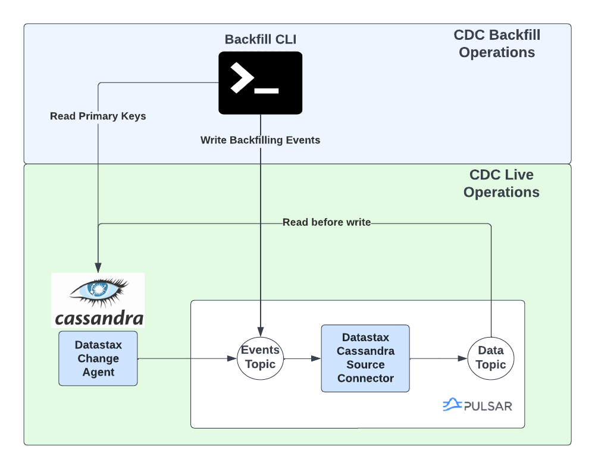

# CDC Backfill CLI

A tool that reads rows from an existing Cassandra table and send their primary keys to the event topic. This will
trigger the Cassandra Source Connector (CSC) to populate the date topics with historical rows (i.e. existed 
before enabling cdc on the table). 

Please note that CSC only guarantees sending the latest state of rows and not
necessarily their intermediary states. For that reason, it is safe to run the backfill CLI while CSC is running.

At a high level, the backfill CLI works as follows:
* Exports the primary key of the table to a Comma Separated Vile (CSV) leveraging the DataStax Bulk Loader (DSBulk). That file will be stored in disk.
* Reads the CSV file and sends the primary keys to the event topic. The CSC will then read the primary keys and populate the data topics.



## Requirements
On the CLI machine side:
 * Java 8 or Java 11 Runtime Environment (JRE)
 * Optional: If running the CLI as a Pulsar Admin Extension, Datastax Luna Streaming 2.10_3.1 or later required. It is enough to download the standalone Luna Streaming Shell found on https://github.com/datastax/pulsar/releases.  
 
On the Cassandra/Pulsar side:
 * DataStax CDC for Apache Cassandra 2.2.5 or later

## Building
The CLI is build using Gradle. To build the CLI, run the following command:
```
git clone git@github.com:datastax/cdc-apache-cassandra.git
cd cdc-apache-cassandra
./gradlew backfill-cli:assemble
```

This will generate two main artifacts:
* An uber jar file containing the CLI and all its dependencies: `backfill-cli/build/libs/backfill-cli-<version>-all.jar`
* A NAR archive that wraps the CLI as a Pulsar Admin Extension: `backfill-cli/build/libs/pulsar-cassandra-admin-<version>-nar.nar`

## Testing
To run the CLI unit tests, run the following command:
```
./gradlew backfill-cli:test
```
The integration tests run as a Github CI action against different flavors of Apache Cassandra and Pulsar. To run the integration tests locally, run the following command:
```
 ./gradlew backfill-cli:e2eTest -PcassandraFamily=dse4 -PtestPulsarImage=datastax/lunastreaming -PtestPulsarImageTag=2.10_2.4
```
The supported values for the `cassandraFamily` property are: `[c3, c4, dse4]`

## Running the CLI
The backfill CLI can be run in two flavors:
* As a standalone Java application: You can execute the CLI from the generated jar file as follows:
```
java -jar backfill-cli/build/libs/backfill-cli-<version>-all.jar --data-dir target/export --export-host 127.0.0.1:9042 \
 --export-username cassandra --export-password=<passowrd> --keyspace ks1 --table table1 
```
* [Recommended] As a Pulsar Admin Extension : You can execute the CLI as a Pulsar Admin Extension as follows:
  * Add the generated NAR archive `pulsar-cassandra-admin-<version>-nar.nar` to the Luna Streaming `cliextensions` directory (e.g. /pulsar/cliextensions)
  * Update the `client.conf` file to include the following property: `customCommandFactories=cassandra-cdc`
  * Run the CLI as follows:
```
./bin/pulsar-admin cassandra-cdc backfill --data-dir target/export --export-host 127.0.0.1:9042 \
 --export-username cassandra --export-password cassandra --keyspace ks1 --table table1
```

## Backfill CLI Parameters
The backfill CLI parameters falls into three groups: 
* The Cassandra parameters (used by DSBulk to export table data, e.g. `--export-username, --export-password, --keyspace, --table`)
* The Pulsar parameters (used to configure the CLI import component to send the primary keys to the event topic, e.g. `--pulsar-url, --pulsar-auth-params, --events-topic-prefix`)

To see the full list of parameters, run the following command:
```
java -jar backfill-cli/build/libs/backfill-cli-<version>-all.jar --help
```
or
```
./bin/pulsar-admin cassandra-cdc
```

Please note the following regarding the parameters:
* When running the CLI as a Pulsar Admin Extension, all `--pulsar-*` parameters are loaded from the `client.conf` file. 
* The `--dsbulk-log-dir` is only available when running the CLI as a standalone Java application.
* It is possible to pass extra parameters to DSBulk by using the `--export-dsbulk-option` parameter. The relevant DSBulk settings are the ones that configure the CVS connector and can be found https://github.com/datastax/dsbulk/blob/1.10.x/manual/settings.md#connector.csv.
