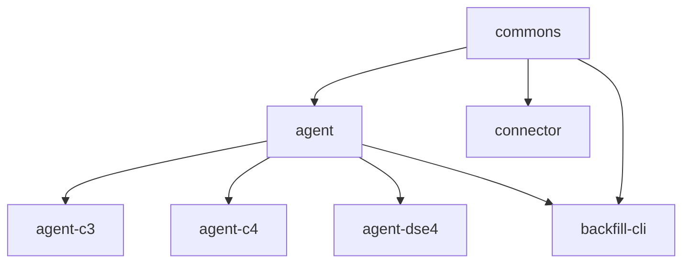
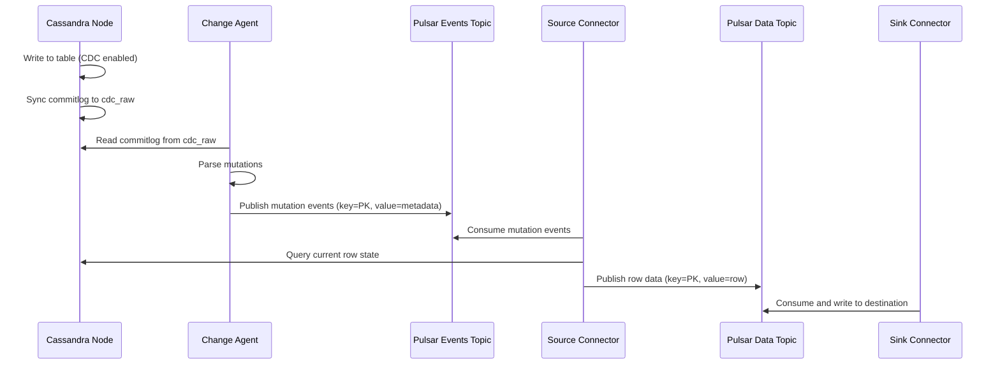
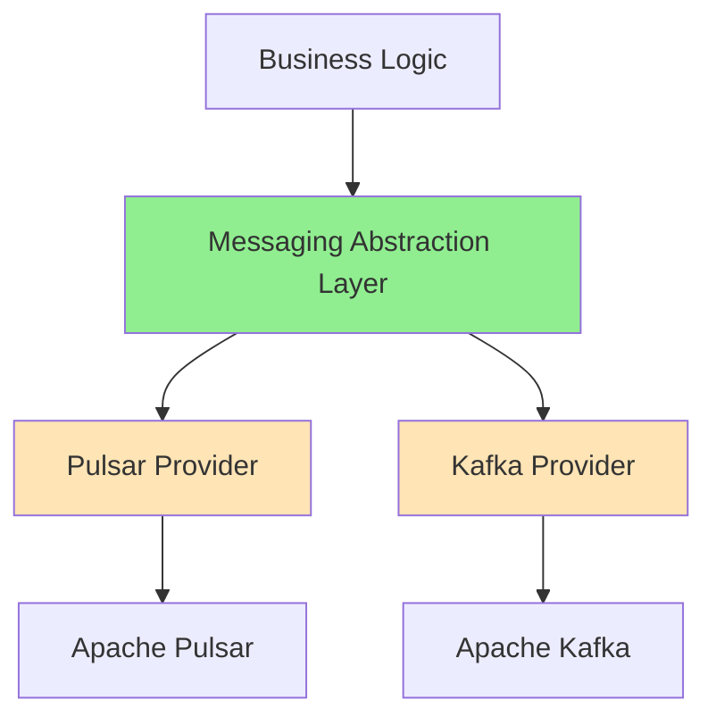

# CDC for Apache Cassandra - Project Architecture Summary

**Project Version:** 2.3.7  
**Last Updated:** 2026-03-17  
**Purpose:** Change Data Capture (CDC) system for Apache Cassandra with Apache Pulsar integration

---

## Executive Summary

This project implements a Change Data Capture (CDC) solution for Apache Cassandra that captures database mutations and publishes them to Apache Pulsar topics. The system consists of two main components:

1. **Change Agent** - JVM agent deployed on Cassandra nodes that reads commit logs and publishes mutations
2. **Source Connector** - Pulsar source connector that consumes mutations and queries Cassandra for current row state

**Current State:** The system is **tightly coupled to Apache Pulsar** with no abstraction layer for alternative messaging providers.

---

## 1. Project Structure

```
cdc-apache-cassandra/
├── agent/              # Core agent logic (abstract base classes)
├── agent-c3/           # Cassandra 3.x specific agent
├── agent-c4/           # Cassandra 4.x specific agent  
├── agent-dse4/         # DataStax Enterprise 6.8.16+ agent
├── agent-distribution/ # Agent packaging
├── commons/            # Shared utilities and data models
├── connector/          # Pulsar source connector
├── connector-distribution/ # Connector packaging
├── backfill-cli/       # CLI tool for backfilling historical data
├── testcontainers/     # Test infrastructure
└── docs/               # Documentation
```

### Module Dependencies



---

## 2. Architecture Overview

### 2.1 High-Level Data Flow



### 2.2 Component Architecture

#### Change Agent Architecture
```
┌─────────────────────────────────────────────────────────┐
│ Cassandra Node (JVM Agent)                              │
│                                                          │
│  ┌────────────────────────────────────────────────┐    │
│  │ CommitLogReaderService                          │    │
│  │  - Watches cdc_raw directory                    │    │
│  │  - Reads commitlog files                        │    │
│  │  - Maintains processing offsets                 │    │
│  └──────────────┬──────────────────────────────────┘    │
│                 │                                        │
│  ┌──────────────▼──────────────────────────────────┐    │
│  │ CommitLogReadHandler                             │    │
│  │  - Parses mutations from commitlog               │    │
│  │  - Filters CDC-enabled tables                    │    │
│  └──────────────┬──────────────────────────────────┘    │
│                 │                                        │
│  ┌──────────────▼──────────────────────────────────┐    │
│  │ PulsarMutationSender (Pulsar-specific)          │    │
│  │  - Creates Pulsar producers per table           │    │
│  │  - Serializes primary keys to AVRO              │    │
│  │  - Publishes to events-<keyspace>.<table>       │    │
│  │  - Handles batching, retries, SSL/TLS           │    │
│  └──────────────┬──────────────────────────────────┘    │
│                 │                                        │
│                 ▼                                        │
│         Pulsar Events Topic                              │
└─────────────────────────────────────────────────────────┘
```

#### Source Connector Architecture
```
┌─────────────────────────────────────────────────────────┐
│ Pulsar Source Connector                                  │
│                                                          │
│  ┌────────────────────────────────────────────────┐    │
│  │ CassandraSource (implements Pulsar Source)     │    │
│  │  - Consumes from events topic                   │    │
│  │  - Manages mutation cache for deduplication     │    │
│  │  - Adaptive query executor pool                 │    │
│  └──────────────┬──────────────────────────────────┘    │
│                 │                                        │
│  ┌──────────────▼──────────────────────────────────┐    │
│  │ CassandraClient                                  │    │
│  │  - Queries Cassandra for current row state      │    │
│  │  - Handles schema changes                        │    │
│  │  - Connection pooling                            │    │
│  └──────────────┬──────────────────────────────────┘    │
│                 │                                        │
│  ┌──────────────▼──────────────────────────────────┐    │
│  │ Converters (Schema Translation)                 │    │
│  │  - NativeAvroConverter                           │    │
│  │  - NativeJsonConverter                           │    │
│  │  - AvroConverter, JsonConverter, etc.            │    │
│  └──────────────┬──────────────────────────────────┘    │
│                 │                                        │
│                 ▼                                        │
│         Pulsar Data Topic                                │
└─────────────────────────────────────────────────────────┘
```

---

## 3. Apache Pulsar Integration Analysis

### 3.1 Pulsar Client Initialization

**Location:** `agent/src/main/java/com/datastax/oss/cdc/agent/AbstractPulsarMutationSender.java`

```java
// Lines 92-126: Direct Pulsar client creation
public void initialize(AgentConfig config) throws PulsarClientException {
    ClientBuilder clientBuilder = PulsarClient.builder()
        .serviceUrl(config.pulsarServiceUrl)
        .memoryLimit(config.pulsarMemoryLimitBytes, SizeUnit.BYTES)
        .enableTcpNoDelay(false);
    
    // SSL/TLS configuration
    if (config.pulsarServiceUrl.startsWith("pulsar+ssl://")) {
        clientBuilder.tlsTrustStorePath(config.sslKeystorePath)
            .tlsTrustStorePassword(config.sslTruststorePassword)
            // ... more SSL config
    }
    
    // Authentication
    if (config.pulsarAuthPluginClassName != null) {
        clientBuilder.authentication(
            config.pulsarAuthPluginClassName, 
            config.pulsarAuthParams
        );
    }
    
    this.client = clientBuilder.build();
}
```

**Tight Coupling Issues:**
- Direct instantiation of `PulsarClient`
- Pulsar-specific configuration parameters
- No interface abstraction
- Hard-coded Pulsar URL scheme detection

### 3.2 Producer Creation

**Location:** `agent/src/main/java/com/datastax/oss/cdc/agent/AbstractPulsarMutationSender.java`

```java
// Lines 180-224: Pulsar producer creation
public Producer<KeyValue<byte[], MutationValue>> getProducer(final TableInfo tm) {
    org.apache.pulsar.client.api.Schema<KeyValue<byte[], MutationValue>> keyValueSchema = 
        org.apache.pulsar.client.api.Schema.KeyValue(
            new NativeSchemaWrapper(getAvroKeySchema(tm).schema, SchemaType.AVRO),
            org.apache.pulsar.client.api.Schema.AVRO(MutationValue.class),
            KeyValueEncodingType.SEPARATED
        );
    
    ProducerBuilder<KeyValue<byte[], MutationValue>> producerBuilder = 
        client.newProducer(keyValueSchema)
            .producerName(topicAndProducerName.producerName)
            .topic(k)
            .sendTimeout(0, TimeUnit.SECONDS)
            .hashingScheme(HashingScheme.Murmur3_32Hash)
            .blockIfQueueFull(true)
            .maxPendingMessages(config.pulsarMaxPendingMessages)
            .autoUpdatePartitions(true);
    
    // Batching configuration
    if (config.pulsarBatchDelayInMs > 0) {
        producerBuilder.enableBatching(true)
            .batchingMaxPublishDelay(config.pulsarBatchDelayInMs, TimeUnit.MILLISECONDS);
    }
    
    // Custom partitioning
    if (useMurmur3Partitioner) {
        producerBuilder.messageRoutingMode(MessageRoutingMode.CustomPartition)
            .messageRouter(Murmur3MessageRouter.instance);
    }
    
    return producerBuilder.create();
}
```

**Tight Coupling Issues:**
- Pulsar-specific `ProducerBuilder` API
- Pulsar schema types (`KeyValue`, `SchemaType.AVRO`)
- Pulsar-specific batching and partitioning
- No abstraction for producer lifecycle

### 3.3 Message Publishing

**Location:** `agent/src/main/java/com/datastax/oss/cdc/agent/AbstractPulsarMutationSender.java`

```java
// Lines 244-270: Message sending
public CompletableFuture<MessageId> sendMutationAsync(final AbstractMutation<T> mutation) {
    Producer<KeyValue<byte[], MutationValue>> producer = getProducer(mutation);
    SchemaAndWriter schemaAndWriter = getAvroKeySchema(mutation);
    
    TypedMessageBuilder<KeyValue<byte[], MutationValue>> messageBuilder = 
        producer.newMessage();
    
    messageBuilder = messageBuilder
        .value(new KeyValue(
            serializeAvroGenericRecord(buildAvroKey(schemaAndWriter.schema, mutation), 
                                      schemaAndWriter.writer),
            mutation.mutationValue()))
        .property(Constants.SEGMENT_AND_POSITION, mutation.getSegment() + ":" + mutation.getPosition())
        .property(Constants.TOKEN, mutation.getToken().toString());
    
    if (mutation.getTs() != -1) {
        messageBuilder = messageBuilder.property(Constants.WRITETIME, mutation.getTs() + "");
    }
    
    return messageBuilder.sendAsync();
}
```

**Tight Coupling Issues:**
- Returns Pulsar-specific `MessageId`
- Uses Pulsar `TypedMessageBuilder`
- Pulsar message properties API
- No abstraction for message metadata

### 3.4 Consumer Implementation

**Location:** `connector/src/main/java/com/datastax/oss/pulsar/source/CassandraSource.java`

```java
// Lines 296-306: Consumer creation
ConsumerBuilder<KeyValue<GenericRecord, MutationValue>> consumerBuilder = 
    sourceContext.newConsumerBuilder(eventsSchema)
        .consumerName("CDC Consumer")
        .topic(dirtyTopicName)
        .subscriptionName(this.config.getEventsSubscriptionName())
        .subscriptionType(SubscriptionType.valueOf(this.config.getEventsSubscriptionType()))
        .subscriptionMode(SubscriptionMode.Durable)
        .subscriptionInitialPosition(SubscriptionInitialPosition.Earliest);

if (SubscriptionType.Key_Shared.equals(SubscriptionType.valueOf(...))) {
    consumerBuilder.keySharedPolicy(KeySharedPolicy.autoSplitHashRange());
}

this.consumer = consumerBuilder.subscribe();
```

**Tight Coupling Issues:**
- Pulsar `SourceContext` dependency
- Pulsar subscription types and modes
- Pulsar-specific consumer configuration
- Implements Pulsar `Source` interface directly

### 3.5 Schema Management

**Location:** Multiple files

```java
// commons/src/main/java/com/datastax/oss/cdc/NativeSchemaWrapper.java
public class NativeSchemaWrapper implements org.apache.pulsar.client.api.Schema<byte[]> {
    private final org.apache.avro.Schema avroSchema;
    private final SchemaType schemaType;
    
    @Override
    public SchemaInfo getSchemaInfo() {
        return SchemaInfo.builder()
            .name("Cassandra")
            .type(schemaType)
            .schema(avroSchema.toString().getBytes(StandardCharsets.UTF_8))
            .build();
    }
}
```

**Tight Coupling Issues:**
- Implements Pulsar `Schema` interface
- Uses Pulsar `SchemaInfo` and `SchemaType`
- No abstraction for schema registry

---

## 4. Configuration Management

### 4.1 Agent Configuration

**Location:** `agent/src/main/java/com/datastax/oss/cdc/agent/AgentConfig.java`

**Pulsar-Specific Parameters:**
```java
// Pulsar connection
public String pulsarServiceUrl = "pulsar://localhost:6650";
public String pulsarAuthPluginClassName;
public String pulsarAuthParams;

// Pulsar producer settings
public long pulsarBatchDelayInMs = -1L;
public boolean pulsarKeyBasedBatcher = false;
public int pulsarMaxPendingMessages = 1000;
public long pulsarMemoryLimitBytes = 0L;

// SSL/TLS (shared but Pulsar-configured)
public String sslTruststorePath;
public String sslTruststorePassword;
public String sslTruststoreType = "JKS";
public boolean sslAllowInsecureConnection = false;
public boolean sslHostnameVerificationEnable = false;
```

**Configuration Sources:**
1. Environment variables (e.g., `CDC_PULSAR_SERVICE_URL`)
2. System properties (e.g., `-Dcdc.pulsarServiceUrl=...`)
3. Agent parameters (e.g., `pulsarServiceUrl=pulsar://...`)

### 4.2 Connector Configuration

**Location:** `connector/src/main/java/com/datastax/oss/cdc/CassandraSourceConnectorConfig.java`

**Key Configuration Classes:**
- `CassandraSourceConnectorConfig` - Cassandra connection settings
- `CassandraSourceConfig` - Pulsar-specific connector settings

**Pulsar Integration Points:**
- Events topic name
- Subscription name and type
- Consumer configuration
- Schema format (AVRO/JSON)

---

## 5. Dependency Analysis

### 5.1 Pulsar Dependencies

**From `gradle.properties`:**
```properties
pulsarGroup=org.apache.pulsar
pulsarVersion=3.0.3
```

**From `connector/build.gradle`:**
```gradle
compileOnly("${pulsarGroup}:pulsar-client-original:${pulsarVersion}")
compileOnly("${pulsarGroup}:pulsar-io-common:${pulsarVersion}")
compileOnly("${pulsarGroup}:pulsar-io-core:${pulsarVersion}")
```

**From `agent-dse4/build.gradle`:**
```gradle
implementation("${pulsarGroup}:pulsar-client:${pulsarVersion}")
```

### 5.2 Kafka Dependencies

**From `connector/build.gradle`:**
```gradle
implementation("org.apache.kafka:connect-api:${kafkaVersion}")  // 3.9.1
```

**Note:** Kafka Connect API is used for converter interfaces but not for actual Kafka integration.

---

## 6. Code Locations with Pulsar-Specific Logic

### 6.1 Agent Module

| File | Lines | Pulsar-Specific Code |
|------|-------|---------------------|
| `agent/src/main/java/com/datastax/oss/cdc/agent/AbstractPulsarMutationSender.java` | 35-38, 68-330 | Pulsar client, producer, schema, message sending |
| `agent-dse4/src/main/java/com/datastax/oss/cdc/agent/PulsarMutationSender.java` | 1-162 | DSE-specific Pulsar mutation sender |
| `agent/src/main/java/com/datastax/oss/cdc/agent/AgentConfig.java` | 268-322 | Pulsar configuration parameters |

### 6.2 Connector Module

| File | Lines | Pulsar-Specific Code |
|------|-------|---------------------|
| `connector/src/main/java/com/datastax/oss/pulsar/source/CassandraSource.java` | 52-68, 138-866 | Pulsar Source interface, consumer, schema |
| `connector/src/main/java/com/datastax/oss/pulsar/source/Converter.java` | 18 | Pulsar Schema import |
| `connector/src/main/java/com/datastax/oss/pulsar/source/converters/*` | All | Pulsar schema converters |

### 6.3 Commons Module

| File | Lines | Pulsar-Specific Code |
|------|-------|---------------------|
| `commons/src/main/java/com/datastax/oss/cdc/NativeSchemaWrapper.java` | 18-22 | Pulsar Schema interface implementation |
| `commons/src/main/java/com/datastax/oss/cdc/Murmur3MessageRouter.java` | 18-20 | Pulsar MessageRouter implementation |

### 6.4 Backfill CLI Module

| File | Lines | Pulsar-Specific Code |
|------|-------|---------------------|
| `backfill-cli/src/main/java/com/datastax/oss/cdc/backfill/factory/PulsarMutationSenderFactory.java` | 1-64 | Pulsar mutation sender factory |
| `backfill-cli/src/main/java/com/datastax/oss/cdc/backfill/importer/PulsarImporter.java` | All | Pulsar-based data import |

### 6.5 Configuration Files

| File | Pulsar References |
|------|------------------|
| `connector/src/main/resources/META-INF/services/pulsar-io.yaml` | Pulsar connector metadata |
| `gradle.properties` | Pulsar version and group |
| All `build.gradle` files | Pulsar dependencies |

---

## 7. Topic Naming and Message Structure

### 7.1 Topic Naming Convention

**Events Topic (Agent → Connector):**
```
Format: {topicPrefix}{keyspace}.{table}
Default: events-{keyspace}.{table}
Example: events-myks.users
```

**Data Topic (Connector → Sinks):**
```
Format: data-{keyspace}.{table}
Example: data-myks.users
```

### 7.2 Message Structure

**Events Topic Message:**
```
Key: AVRO-serialized primary key
  Schema: Generated from table primary key columns
  Example: {"user_id": 123, "timestamp": 1234567890}

Value: MutationValue (AVRO)
  - md5Digest: String (mutation deduplication)
  - nodeId: UUID (source Cassandra node)

Properties:
  - writetime: String (Cassandra write timestamp in microseconds)
  - segpos: String (commitlog segment:position)
  - token: String (Cassandra partition token)
```

**Data Topic Message:**
```
Key: Primary key (AVRO or JSON)
  Format depends on keyConverter configuration

Value: Full row data (AVRO or JSON)
  - All non-primary-key columns
  - null for DELETE operations

Properties:
  - writetime: String (preserved from events topic)
```

---

## 8. Abstraction Strategy for Dual-Provider Support

### 8.1 Proposed Architecture



### 8.2 Core Abstraction Interfaces

#### 8.2.1 Messaging Client Interface

```java
package com.datastax.oss.cdc.messaging;

public interface MessagingClient extends AutoCloseable {
    /**
     * Create a producer for the specified topic
     */
    <K, V> MessagingProducer<K, V> createProducer(ProducerConfig<K, V> config);
    
    /**
     * Create a consumer for the specified topic
     */
    <K, V> MessagingConsumer<K, V> createConsumer(ConsumerConfig<K, V> config);
    
    /**
     * Get client metrics
     */
    MessagingMetrics getMetrics();
    
    @Override
    void close();
}
```

#### 8.2.2 Producer Interface

```java
package com.datastax.oss.cdc.messaging;

public interface MessagingProducer<K, V> extends AutoCloseable {
    /**
     * Send message asynchronously
     */
    CompletableFuture<MessageMetadata> sendAsync(K key, V value, Map<String, String> properties);
    
    /**
     * Send message synchronously
     */
    MessageMetadata send(K key, V value, Map<String, String> properties) throws MessagingException;
    
    /**
     * Flush pending messages
     */
    void flush() throws MessagingException;
    
    @Override
    void close();
}
```

#### 8.2.3 Consumer Interface

```java
package com.datastax.oss.cdc.messaging;

public interface MessagingConsumer<K, V> extends AutoCloseable {
    /**
     * Receive next message with timeout
     */
    MessagingMessage<K, V> receive(long timeout, TimeUnit unit) throws MessagingException;
    
    /**
     * Acknowledge message
     */
    void acknowledge(MessagingMessage<K, V> message);
    
    /**
     * Negative acknowledge (requeue)
     */
    void negativeAcknowledge(MessagingMessage<K, V> message);
    
    @Override
    void close();
}
```

#### 8.2.4 Message Interface

```java
package com.datastax.oss.cdc.messaging;

public interface MessagingMessage<K, V> {
    K getKey();
    V getValue();
    Map<String, String> getProperties();
    String getMessageId();
    long getPublishTime();
    String getTopic();
}
```

#### 8.2.5 Configuration Interfaces

```java
package com.datastax.oss.cdc.messaging;

public interface MessagingClientConfig {
    String getServiceUrl();
    Map<String, Object> getProperties();
    MessagingProvider getProvider();
}

public interface ProducerConfig<K, V> {
    String getTopic();
    SchemaConfig<K> getKeySchema();
    SchemaConfig<V> getValueSchema();
    Map<String, Object> getProperties();
}

public interface ConsumerConfig<K, V> {
    String getTopic();
    String getSubscriptionName();
    SchemaConfig<K> getKeySchema();
    SchemaConfig<V> getValueSchema();
    Map<String, Object> getProperties();
}
```

### 8.3 Provider Implementation Structure

```
messaging/
├── api/
│   ├── MessagingClient.java
│   ├── MessagingProducer.java
│   ├── MessagingConsumer.java
│   ├── MessagingMessage.java
│   ├── MessagingClientConfig.java
│   ├── ProducerConfig.java
│   ├── ConsumerConfig.java
│   ├── SchemaConfig.java
│   ├── MessagingException.java
│   └── MessagingProvider.java (enum: PULSAR, KAFKA)
│
├── pulsar/
│   ├── PulsarMessagingClient.java
│   ├── PulsarProducer.java
│   ├── PulsarConsumer.java
│   ├── PulsarMessage.java
│   └── PulsarConfigAdapter.java
│
├── kafka/
│   ├── KafkaMessagingClient.java
│   ├── KafkaProducer.java
│   ├── KafkaConsumer.java
│   ├── KafkaMessage.java
│   └── KafkaConfigAdapter.java
│
└── factory/
    └── MessagingClientFactory.java
```

### 8.4 Factory Pattern for Provider Selection

```java
package com.datastax.oss.cdc.messaging.factory;

public class MessagingClientFactory {
    public static MessagingClient createClient(MessagingClientConfig config) {
        switch (config.getProvider()) {
            case PULSAR:
                return new PulsarMessagingClient(config);
            case KAFKA:
                return new KafkaMessagingClient(config);
            default:
                throw new IllegalArgumentException("Unsupported provider: " + config.getProvider());
        }
    }
}
```

### 8.5 Configuration Strategy

**Unified Configuration Format:**
```properties
# Provider selection (mutually exclusive)
messaging.provider=pulsar  # or kafka

# Common settings
messaging.service.url=pulsar://localhost:6650  # or kafka://localhost:9092
messaging.topic.prefix=events-
messaging.ssl.enabled=true
messaging.ssl.truststore.path=/path/to/truststore
messaging.ssl.truststore.password=secret

# Provider-specific settings (prefixed)
# Pulsar-specific
pulsar.batch.delay.ms=10
pulsar.max.pending.messages=1000
pulsar.auth.plugin.class=org.apache.pulsar.client.impl.auth.AuthenticationToken

# Kafka-specific
kafka.acks=all
kafka.compression.type=snappy
kafka.max.in.flight.requests=5
```

### 8.6 Migration Path

**Phase 1: Create Abstraction Layer**
1. Define messaging interfaces in new `messaging-api` module
2. Implement Pulsar provider wrapping existing code
3. Add factory for provider selection
4. No breaking changes to existing functionality

**Phase 2: Refactor Agent**
1. Replace `AbstractPulsarMutationSender` with `AbstractMessagingSender`
2. Use `MessagingClient` instead of `PulsarClient`
3. Update configuration to support provider selection
4. Maintain backward compatibility with existing configs

**Phase 3: Refactor Connector**
1. Create generic `CassandraMessagingSource` interface
2. Implement Pulsar-specific version using abstraction
3. Update schema handling to be provider-agnostic
4. Support both Pulsar and Kafka connectors

**Phase 4: Implement Kafka Provider**
1. Create Kafka implementation of messaging interfaces
2. Map Kafka concepts to abstraction (topics, partitions, offsets)
3. Handle schema registry integration (Confluent Schema Registry)
4. Implement Kafka-specific optimizations

**Phase 5: Testing & Documentation**
1. Create integration tests for both providers
2. Performance benchmarking
3. Migration guide for existing deployments
4. Configuration examples for both providers

---

## 9. Key Design Considerations

### 9.1 Schema Management

**Challenge:** Pulsar has built-in schema registry; Kafka typically uses Confluent Schema Registry

**Solution:**
```java
public interface SchemaRegistry {
    <T> void registerSchema(String topic, Schema<T> schema);
    <T> Schema<T> getSchema(String topic, int version);
    <T> Schema<T> getLatestSchema(String topic);
}

// Implementations:
// - PulsarSchemaRegistry (uses Pulsar's built-in registry)
// - ConfluentSchemaRegistry (uses Confluent Schema Registry)
// - NoOpSchemaRegistry (for testing or schema-less scenarios)
```

### 9.2 Message Ordering

**Pulsar:** Key-based ordering with Key_Shared subscription
**Kafka:** Partition-based ordering

**Solution:** Abstract partitioning strategy
```java
public interface PartitionStrategy {
    int selectPartition(Object key, int numPartitions);
}

// Implementations:
// - Murmur3PartitionStrategy (consistent with Cassandra)
// - HashPartitionStrategy (default hash-based)
// - RoundRobinPartitionStrategy (no key-based ordering)
```

### 9.3 Acknowledgment Semantics

**Pulsar:** Individual message acknowledgment
**Kafka:** Offset-based acknowledgment

**Solution:** Unified acknowledgment interface
```java
public interface MessagingMessage<K, V> {
    void acknowledge();
    void negativeAcknowledge();
    // Internal: track offset/message-id based on provider
}
```

### 9.4 Batching and Performance

**Pulsar:** Built-in batching with time/size limits
**Kafka:** Producer batching with linger.ms

**Solution:** Unified batching configuration
```java
public interface BatchConfig {
    long getBatchDelayMs();
    int getBatchMaxMessages();
    long getBatchMaxBytes();
}
```

### 9.5 Error Handling and Retries

**Both providers support:**
- Retry policies
- Dead letter queues
- Error handling

**Solution:** Unified error handling
```java
public interface ErrorHandler {
    void handleError(MessagingException e, MessagingMessage<?, ?> message);
    boolean shouldRetry(MessagingException e);
    long getRetryDelayMs(int attemptNumber);
}
```

---

## 10. Current Limitations and Technical Debt

### 10.1 Tight Coupling Issues

1. **No Abstraction Layer**
   - Direct use of Pulsar APIs throughout codebase
   - Pulsar-specific types in method signatures
   - Hard to test without Pulsar infrastructure

2. **Configuration Coupling**
   - Pulsar-specific parameter names
   - No provider selection mechanism
   - Environment variables tied to Pulsar

3. **Schema Coupling**
   - Pulsar Schema interface implementations
   - SchemaType enum usage
   - No generic schema abstraction

4. **Package Structure**
   - `com.datastax.oss.pulsar.source` package name
   - Pulsar in class names (e.g., `PulsarMutationSender`)
   - Pulsar-specific test utilities

### 10.2 Code Duplication

1. **Agent Implementations**
   - Similar code in agent-c3, agent-c4, agent-dse4
   - Only differ in Cassandra version-specific APIs
   - Pulsar integration duplicated across all

2. **Converter Implementations**
   - Multiple converter classes with similar structure
   - Schema translation logic repeated
   - Could benefit from common base class

### 10.3 Testing Challenges

1. **Integration Tests**
   - Require Pulsar testcontainers
   - Slow test execution
   - Complex test setup

2. **Unit Tests**
   - Difficult to mock Pulsar components
   - Limited test coverage for edge cases
   - No provider-agnostic tests

---

## 11. Performance Characteristics

### 11.1 Agent Performance

**Throughput:**
- Depends on commitlog sync period (default: 10 seconds for C4/DSE, on flush for C3)
- Batching improves throughput (configurable via `pulsarBatchDelayInMs`)
- Multiple concurrent processors (configurable via `cdcConcurrentProcessors`)

**Latency:**
- Near real-time for C4/DSE (10-second sync period)
- Flush-based for C3 (higher latency)
- Network latency to Pulsar cluster

**Resource Usage:**
- Memory: Pulsar client buffer (`pulsarMemoryLimitBytes`)
- CPU: Commitlog parsing and AVRO serialization
- Disk: CDC working directory for offsets and archived logs

### 11.2 Connector Performance

**Throughput:**
- Adaptive query executor pool (1-N threads)
- Batch processing (configurable via `batchSize`)
- Mutation cache for deduplication

**Latency:**
- CQL query latency to source Cassandra
- Mutation cache hit rate
- Pulsar consumer throughput

**Resource Usage:**
- Memory: Mutation cache (`cacheMaxCapacity`, `cacheMaxDigests`)
- CPU: Schema conversion and CQL queries
- Network: Cassandra queries and Pulsar consumption

---

## 12. Monitoring and Observability

### 12.1 Agent Metrics

**Available Metrics:**
- Skipped mutations count
- Commitlog processing rate
- Pulsar send latency
- Error rates

**Monitoring Integration:**
- JMX metrics export
- Prometheus exporter support
- Grafana dashboard templates

### 12.2 Connector Metrics

**Available Metrics:**
- Cache hit/miss/eviction rates (`cache_hits`, `cache_misses`, `cache_evictions`)
- Cache size (`cache_size`)
- Query latency (`query_latency`)
- Query executor count (`query_executors`)
- Replication latency (`replication_latency`)

**Pulsar Integration:**
- Uses Pulsar's `SourceContext.recordMetric()`
- Metrics exposed via Pulsar metrics endpoint

---

## 13. Security Considerations

### 13.1 SSL/TLS Support

**Current Implementation:**
- Supports SSL/TLS for Pulsar connections
- Truststore and keystore configuration
- Cipher suite and protocol selection
- Hostname verification

**Configuration:**
```properties
sslTruststorePath=/path/to/truststore.jks
sslTruststorePassword=secret
sslTruststoreType=JKS
sslKeystorePath=/path/to/keystore.jks
sslKeystorePassword=secret
sslAllowInsecureConnection=false
sslHostnameVerificationEnable=true
```

### 13.2 Authentication

**Pulsar Authentication:**
- Plugin-based authentication
- Supports token, TLS, OAuth2, etc.
- Configuration via `pulsarAuthPluginClassName` and `pulsarAuthParams`

**Cassandra Authentication:**
- Username/password authentication
- SSL/TLS client certificates
- Kerberos support (via DataStax driver)

---

## 14. Deployment Considerations

### 14.1 Agent Deployment

**Installation:**
- JVM agent JAR deployed on each Cassandra node
- Configured via JVM arguments: `-javaagent:/path/to/agent.jar=param1=value1,param2=value2`
- Requires CDC enabled on tables: `ALTER TABLE ... WITH cdc=true`

**Resource Requirements:**
- Minimal CPU overhead (commitlog parsing)
- Memory for Pulsar client buffers
- Disk space for CDC working directory

**High Availability:**
- Agent runs on all nodes (no single point of failure)
- Deduplication handles multiple replicas
- Automatic recovery from failures

### 14.2 Connector Deployment

**Installation:**
- Deployed as Pulsar source connector (NAR file)
- Configured via Pulsar connector configuration
- Can run multiple instances for scalability

**Resource Requirements:**
- Memory for mutation cache
- CPU for CQL queries and schema conversion
- Network bandwidth for Cassandra queries

**Scalability:**
- Horizontal scaling via multiple connector instances
- Key_Shared subscription for parallel processing
- Adaptive query executor pool

---

## 15. Recommendations for Dual-Provider Implementation

### 15.1 Immediate Actions

1. **Create Messaging Abstraction Module**
   - New `messaging-api` module with core interfaces
   - No dependencies on Pulsar or Kafka
   - Clean separation of concerns

2. **Implement Pulsar Provider**
   - Wrap existing Pulsar code in abstraction
   - Maintain backward compatibility
   - Add comprehensive tests

3. **Update Configuration System**
   - Add provider selection parameter
   - Support both Pulsar and Kafka configs
   - Provide migration guide

### 15.2 Medium-Term Goals

1. **Implement Kafka Provider**
   - Full Kafka implementation of messaging interfaces
   - Schema registry integration
   - Performance optimization

2. **Refactor Agent**
   - Replace Pulsar-specific code with abstraction
