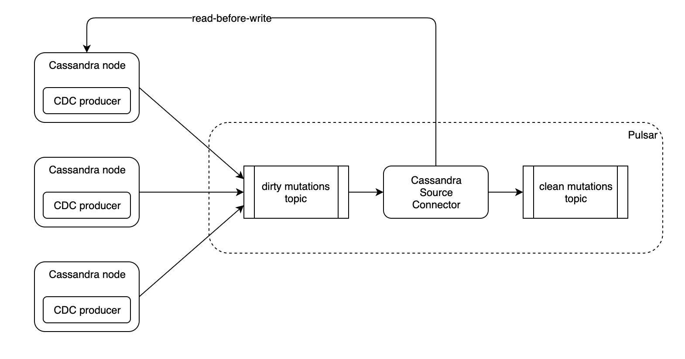

# Cassandra source connector

This Cassandra source connector reads update events from a pulsar "dirty" topic, 
read from Cassandra the updated row, and publish the Cassandra rows into a sinkable pulsar "clean" topic.

Because connector can only write messages to one output topic, we need a "dirty" and a "clean" topic for
every replicated Cassandra tables.

## Build

    ./gradlew pulsar-source:nar

## Test

    ./gradlew clean  pulsar-source:test --tests com.datastax.oss.pulsar.source.CassandraSourceTests
    
## Run

    /Users/vroyer/git/apache/pulsar/bin/pulsar-admin source localrun \
           --archive /Users/vroyer/git/datastax/cassandra-source-connector/pulsar-source/build/libs/pulsar-source-0.1-SNAPSHOT.nar \
           --tenant public \
           --namespace default \
           --name cassandra-source-1 \
           --destination-topic-name clean-ks1.table1 \
           --source-config '{"contactPoints":"localhost:9042", "localDc":"datacenter1", "keyspace":"ks1", "table":"table1", "dirtyTopicPrefix": "persistent://public/default/dirty-", "dirtySubscriptionName":"sub1", "keyConverter":"com.datastax.oss.pulsar.source.converters.JsonConverter","valueConverter":"com.datastax.oss.pulsar.source.converters.AvroConverter"}'
